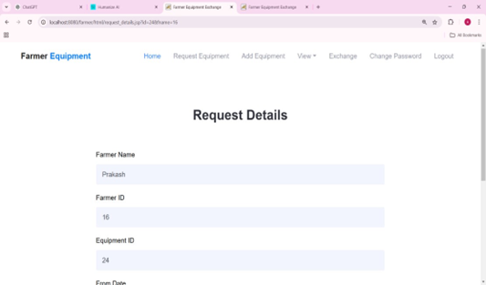
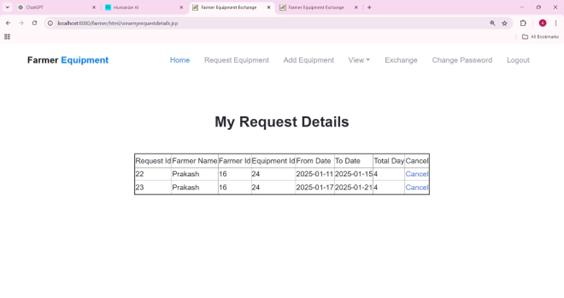
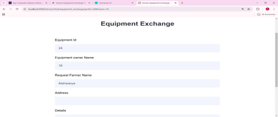

# 🚜 Farmer Equipment Exchange  
A web-based application that enables farmers to share and exchange agricultural equipment without monetary transactions.

## 📌 Features
- Farmer Registration & Login  
- Equipment Listing by Owners  
- Equipment Request System  
- Equipment Exchange without Cost  
- View Available Equipment  
- Request Approval & Cancellation  
- Equipment Return Management  
- Admin Dashboard  

## 🖼 Application Screenshots

### Request Details  

### Cancel Rent

### Equipment Exchange 

## 🛠 Technology Stack
Frontend:
- HTML  
- CSS  
- JavaScript  

Middle Tier:
- JSP  
- Apache Tomcat Server  

Backend:
- MySQL  
- WAMP Server  

## ⚡ Installation (Local Setup)

1. Install WAMP Server  
2. Install Apache Tomcat Server  
3. Copy project folder to:
E:\farmer

4. Create Database in phpMyAdmin:
farmer_equipment_db

5. Import SQL file (if available)

6. Configure database in:
dbconnection.jsp

7. Deploy project in Tomcat:
C:\Program Files\Apache Software Foundation\Tomcat\webapps

8. Run project in browser:
http://localhost:8080/farmer

## 📁 Project Structure
farmer/
│── css/
│── js/
│── images/
│── jsp/
│── dbconnection.jsp
│── index.jsp

## 🔐 Admin Panel
http://localhost:8080/farmer/admin

## ⚠ Common Issues
- Database connection error → Check dbconnection.jsp  
- Page not loading → Check Tomcat server  
- CSS not loading → Check css folder path  

## 👩‍💻 Author
Aishwarya Jalli  
MCA Fresher – KLE IT College, Hubli
